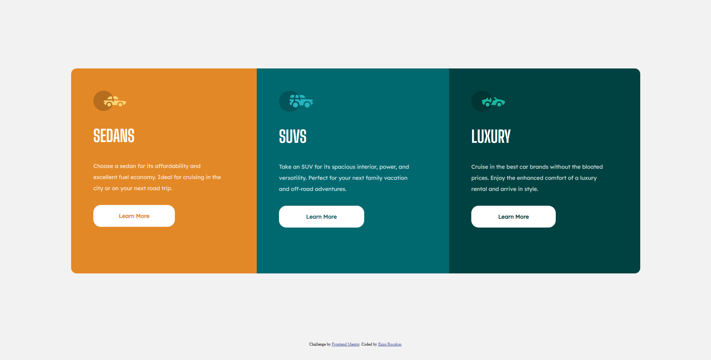

# Frontend Mentor - 3-column preview card component

## The challenge

Users should be able to:

- View the optimal layout depending on their device's screen size
- See hover states for interactive elements

## Screenshot of the final solution

## Links

You can find my solution online at 

- Github pages [https://enzobocalon.github.io/frontendmentor/projects/3-column-preview-card-component-main/]

## Tools

- HTML 5 and CSS 3

## Author

- Enzo Bocalon [https://github.com/enzobocalon]
