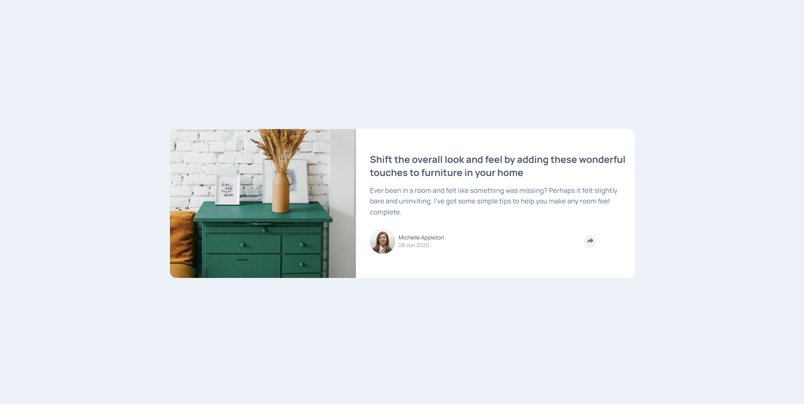

image.png<h1 align="center"> Frontend Mentor - Article preview component solution </h1>

## The challenge

Users should be able to:

- View the optimal layout for the component depending on their device's screen size
- See the social media share links when they click the share icon

## Screenshot of the final solution

## Links
You can find my solution online at

- Github Pages [https://enzobocalon.github.io/frontendmentor/projects/article-preview-component-master]

## Tools

- HTML 5, CSS 3 and JS

## Author

- Enzo Bocalon [https://github.com/enzobocalon]