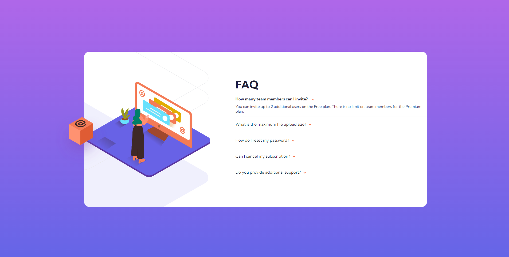

<h1 align="center"> Frontend Mentor - FAQ accordion card </h1>

## The challenge

Users should be able to:

- View the optimal layout for the component depending on their device's screen size
- See hover states for all interactive elements on the page
- Hide/Show the answer to a question when the question is clicked

## Screenshot of the final solution

## Links
You can find my solution online at

- Github Pages [https://enzobocalon.github.io/frontendmentor/projects/faq-accordion-card-main]

## Tools

- HTML 5, CSS 3 and JS

## Author

- Enzo Bocalon [https://github.com/enzobocalon]