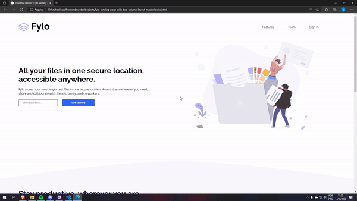

<h1 align="center">Frontend Mentor - Fylo landing page with two column layout solution</h1>

## The challenge

Users should be able to:

- View the optimal layout for the site depending on their device's screen size
- See hover states for all interactive elements on the page

## Screenshot of the final solution

## Links

You can find my solution online at

- Github pages [https://enzobocalon.github.io/frontendmentor/projects/fylo-landing-page-with-two-column-layout-master/]

## Tools

- HTML 5 and CSS 3;

## Author

- Enzo Bocalon [https://github.com/enzobocalon]
