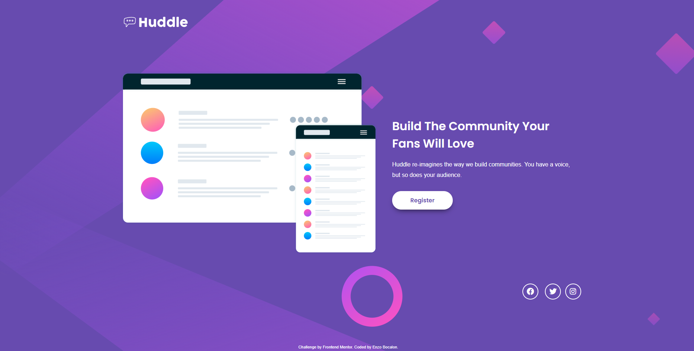

<h1 align="center"> Frontend Mentor - Huddle landing page with single introductory section solution </h1>

This is my solution to the [Huddle landing page with single introductory section challenge on Frontend Mentor](https://www.frontendmentor.io/challenges/huddle-landing-page-with-a-single-introductory-section-B_2Wvxgi0).

## The Challenge
The main goal is to create a landing page by using Flexbox and some CSS selectors such as hover, nth-child and others. I also used some pseudoelements.

## Screenshot of the Final Solution

## Links

You can find my solution online at:

- Github pages []

## Useful Resources

- Thanks to [Mr Coder](https://www.youtube.com/watch?v=lViWtkCGqrU) for some helpful tips and tricks while building this page.

## Author

- Enzo Bocalon [https://github.com/enzobocalon]