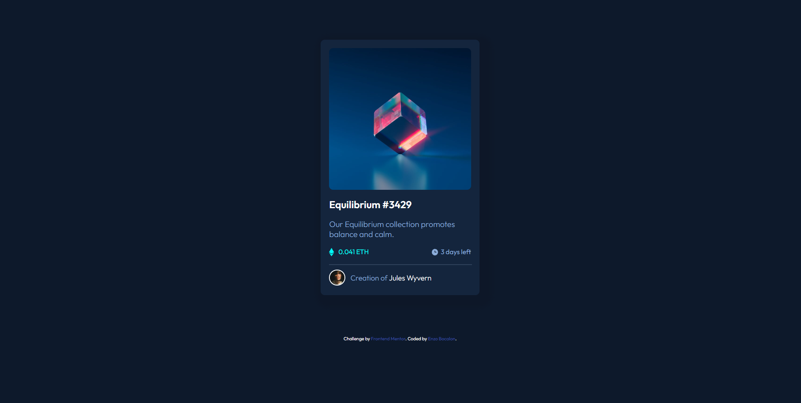

<h1 align="center" style="padding-top: 20px">#FrontEnd Mentor - NFT Preview Card Component</h1>

This is a solution to the [NFT preview card component challenge on Frontend Mentor](https://www.frontendmentor.io/challenges/nft-preview-card-component-SbdUL_w0U).

## The Challenge
Users should be able to:

- View the optimal layout depending on their device's screen size;
- See hover states for interactive elements;

## Screenshot Of The Final Solution

## Links

You can find my solution online at:

- Github pages [https://enzobocalon.github.io/frontendmentor/projects/nft-preview-card-component-main/]

## What I learned

- HTML 5 markups;
- CSS containers behavior;
- Transitions using CSS;
- Flex box;

## Useful Resources

- [https://www.w3schools.com/howto/howto_css_image_overlay_icon.asp] - This website helped me when I had to create the hover effect on the NFT image

## Author
- Enzo Bocalon [https://github.com/enzobocalon/]
