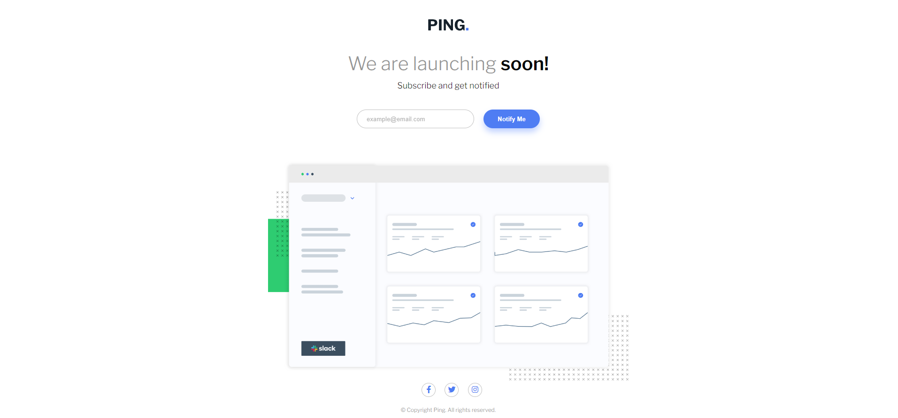

<h1 align="center">Frontend Mentor - Ping coming soon page solution</h1>

## The challenge

Users should be able to:

- View the optimal layout for the site depending on their device's screen size
- See hover states for all interactive elements on the page
- Submit their email address using an `input` field
- Receive an error message when the `form` is submitted if:
	- The `input` field is empty. The message for this error should say *"Whoops! It looks like you forgot to add your email"*
	- The email address is not formatted correctly (i.e. a correct email address should have this structure: `name@host.tld`). The message for this error should say *"Please provide a valid email address"*

## Screenshot of the final solution

## Links
You can find my solution online at

- Github Pages [https://enzobocalon.github.io/frontendmentor/projects/ping-coming-soon-page-master]

## Tools

- HTML 5, CSS 3 and JS

## Author

- Enzo Bocalon [https://github.com/enzobocalon]