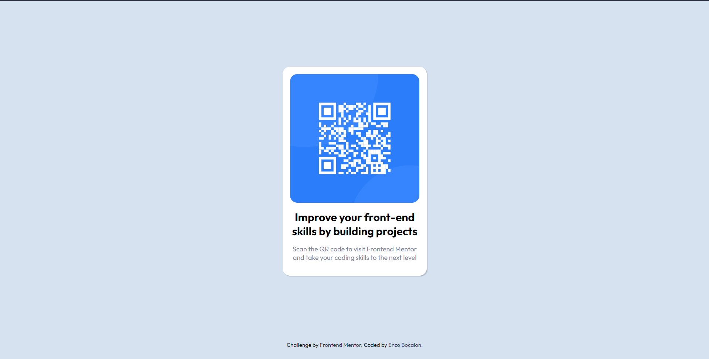

<h1 style="padding: 20px"> Frontend Mentor - QR code component</h1>

## The Challenge

To build a QR code page using HTML 5 and CSS 3 and with that, the users should be able to:

- Visualize the behavior of a website on different aspect ratios;
- Visualize the behavior of flexbox elements;

## Screenshot of the final solution

## Links

You can find my solution online at:

- Github pages [https://enzobocalon.github.io/frontendmentor/projects/qr-code-component-main/]

## What I learned

- HTML 5 markups;
- CSS containers behavior;
- Transitions using CSS;
- Flex box;

## Author
- Enzo Bocalon [https://github.com/enzobocalon/]