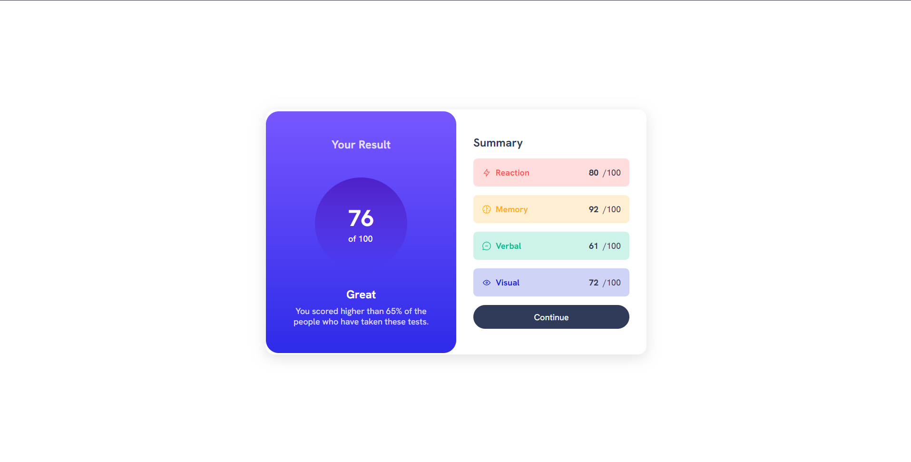

<h1 align="center">Frontend Mentor - Results summary component</h1>

## The Challenge

Users should be able to: 

- View the optimal layout for the interface depending on their device's screen size
- See hover and focus states for all interactive elements on the page

## Screenshot of the final solution

## Links
You can find my solution online at

- Github Pages [https://enzobocalon.github.io/frontendmentor/projects/results-summary-component-main]

## Tools

- HTML 5, CSS 3

## Author

- Enzo Bocalon [https://github.com/enzobocalon]
