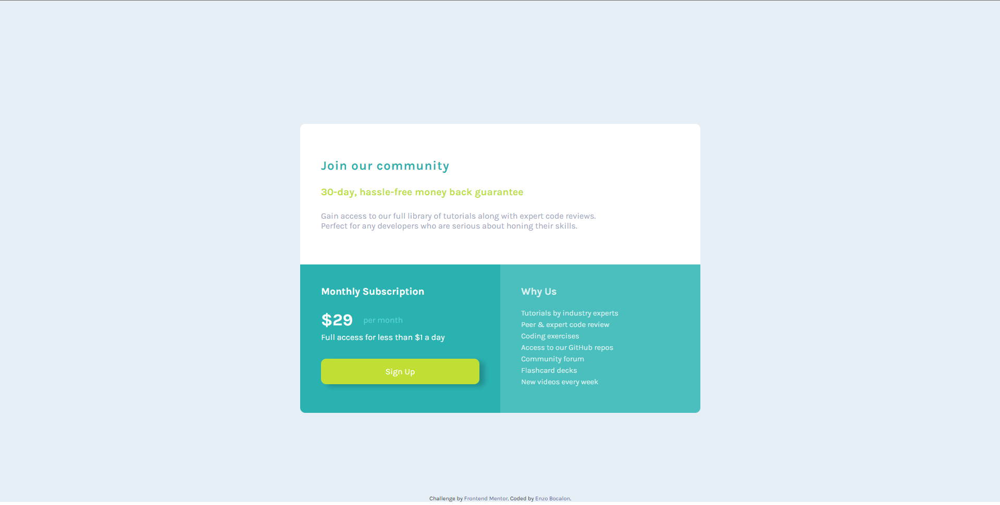

<h1 align="center">Front End Mentor - Single price grid component solution</h1>

This is a solution using flexbox to the challenge [Single price grid component solution](https://www.frontendmentor.io/challenges/single-price-grid-component-5ce41129d0ff452fec5abbbc/hub/single-price-grid-component-N0TkvugY9i)

### The Challenge

Users should be able to:

- View the optimal layout for the component depending on their device's screen size
- See a hover state on desktop for the Sign Up call-to-action

### Screenshot of the Final Solution

### Links

- GitHub pages [https://enzobocalon.github.io/frontendmentor/projects/single-price-grid-component-master/]

### Tools
- Built using HTML 5 and CSS 3

### Author
- Enzo Bocalon [https://github.com/enzobocalon]