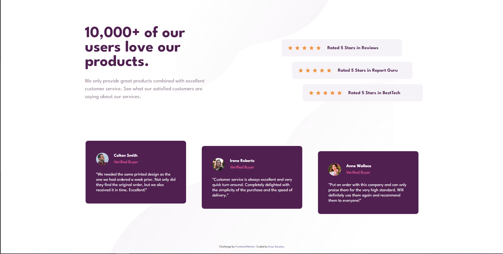

<h1 align="center">Frontend Mentor - Social proof section solution</h1>

## The Challenge
Users should be able to:

- View the optimal layout for the section depending on their device's screen size

## Screenshot of the Final Solution

## Links

You can find my solution online at

- Github Pages [https://enzobocalon.github.io/frontendmentor/projects/social-proof-section-master/]

## Tools

- HTML 5 and CSS 3

## Author

- Enzo Bocalon [https://github.com/enzobocalon]

