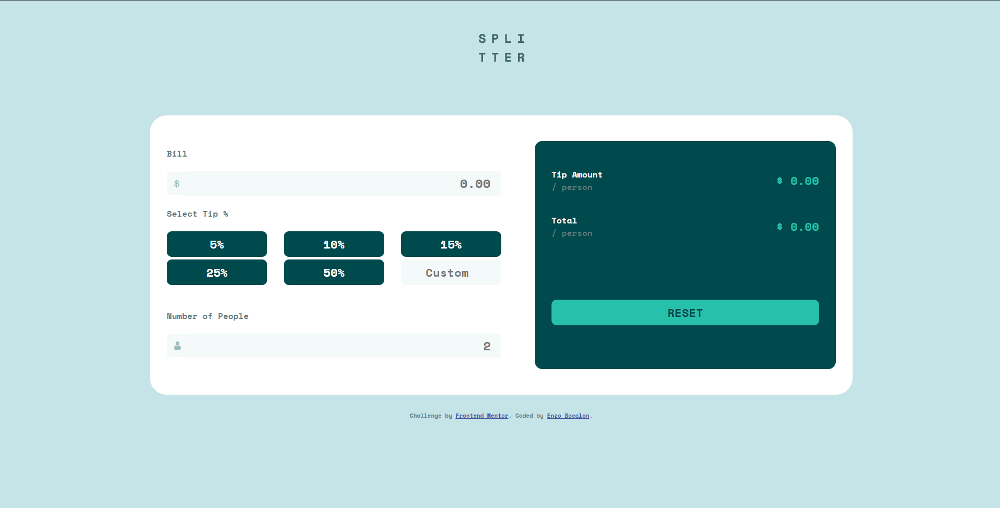

<h1 align="center">Frontend Mentor - Tip calculator app solution</h1>

## The challenge

Users should be able to:

- View the optimal layout for the app depending on their device's screen size
- See hover states for all interactive elements on the page
- Calculate the correct tip and total cost of the bill per person

## Screenshot of the final solution

## Links
You can find my solution online at

- Github Pages [https://enzobocalon.github.io/frontendmentor/projects/tip-calculator-app-main]

## Tools

- HTML 5, CSS 3 and JS

## Author

- Enzo Bocalon [https://github.com/enzobocalon]